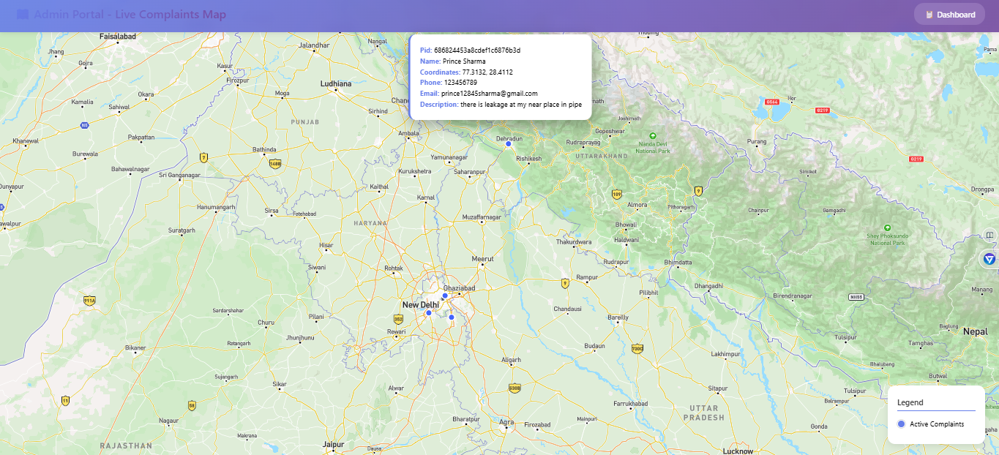
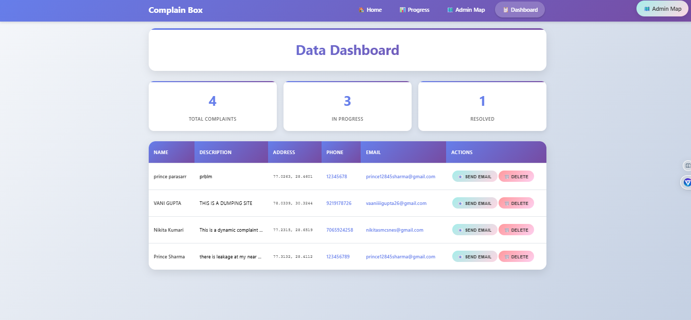
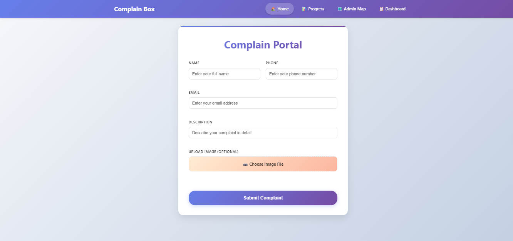

# Streamline Complaints Management with Real-Time Insights 📩

A powerful complaint management system designed to enhance transparency and efficiency. This platform provides a dynamic map-based dashboard and real-time email notifications to keep users informed about complaint progress.

## 🛠️ Project Overview
Created a **citizen-facing water leakage detection and reporting portal**, enabling users to easily report leaks and automatically alert relevant departments for rapid response.

**Tech Stack** – MERN Stack, Mapbox, and Google Email API

## 🚀 Features
- **Dashboard for Complaint Tracking** – View and manage complaints in an interactive interface.
- **Dynamic Map Integration** – Visualize complaints geographically using Mapbox.
- **Real-Time Email Notifications** – Keep users updated on complaint status for better transparency.
- **User-Friendly Interface** – Simple and intuitive design for efficient complaint resolution.
- **Technology Stack** – Built using **MERN Stack, Mapbox, and Google Email API** for seamless performance.

## 🌐 Live Project
🔗 [Complain Portal](https://complain-frontend.vercel.app/)

## 🖼️ Screenshots

### 🗺️ Map View


### 📊 Dashboard View


### 📮 Complaint Portal Interface



## ⚙️ Installation & Setup

### 1. Clone the backend repository:
```bash
git clone https://github.com/Prince-Sharma002/complain-backend.git
````

### 2. Navigate to the project directory and install dependencies:

```bash
cd complain-backend
npm install
```

### 3. Start the backend server:

```bash
npm start
```

### 4. Open the live project link to access the frontend:

[https://complain-frontend.vercel.app/](https://complain-frontend.vercel.app/)

---

## 🤝 Contributions

Contributions are welcome! Feel free to fork the repository and submit a pull request with improvements.

## 📄 License

This project is licensed under the **MIT License**.

## 📬 Contact

For any queries or contributions, reach out via [GitHub](https://github.com/Prince-Sharma002) or email.

```


